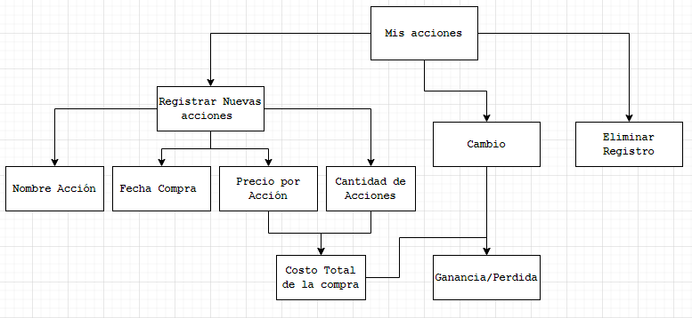

<h1 align="center">
    Escuela Politécnica Nacional 
    Facultad de Ingeniería en Sistemas 
    Construcción y Evolución de Software 
    
</h1>

### Grupo: 9

### Integrantes
- Joel Delgado
- Erik Chalacama
- Ariel Suntasig

# Mapa conceptual
Se tomó como ejemplo a una accion registrada por el cliente para realizar un diagrama conceptual con todos los elementos que debe contener. 

  

  <em>Figura 1: Mapa conceptual</em>

Así, se puede observar como la accion se registra con exito o como esta puede ser eliminada del registro. 